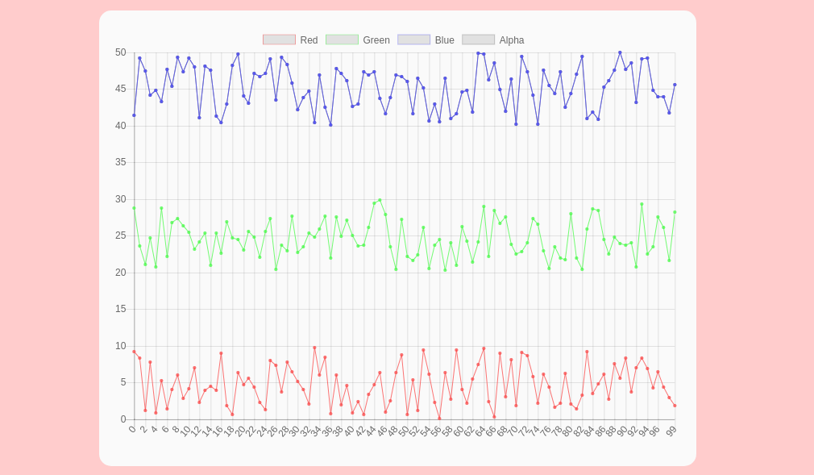

# What is it for?
[DEMO](http://me.jonathanlurie.fr/SpectrumPlot2/examples/)
Displaying line charts like that  


# Instanciate

To create an instance of SpectrumPlot2, we need:
- a parent div (its ID as a String or directly the DOM object)
- a desired width and height

```javascript
var sp = new SpectrumPlot2.SpectrumPlot2( "chartDiv", 400, 300 );
```

## Feed with some data
Each spectrum has:
- a name, to show as a label
- an `Array` of numbers, the data itself
- a color, to apply to the line (must have css format)

```javascript
// we create an array of size 100
var series = new Array(100);

// filling the data array with random values
for(var i=0; i<seriesSize; i++){
  series[i] = Math.random();
}

// giving the data
var seriesIndex = sp.addSpectrum( 
  "Intensities", // name
  series, // the data
  "#FF0000" // the color
)

```

Note that wothout setting teh labels along the `x` axis, the series will not display properly. If labels do not matter, we can use automatic mode:

```javascript
// using no argument, a list of incremental index is created
sp.setLabels();
```

If labels matter, we have to define an array that contains all the labels. It's important to know that it is the label array that defines the length of the displayed data. If shorter than the spectrum's data, then the spectrum plot will be cut.

```javascript
// in this example, only the 8 first point of the spectrum(s) will be displayed
sp.setLabels([
  'a', 'b', 'c', 'd', 'e', 'f', 'g', 'h'
]);
```

# Draw
When having several spectrum, it is usually more optimal to be sure all the spectrum are added/updated before we can re-draw. This is why SpectrumPlot2 needs an explicit call:

```javascript
sp.draw();
```

# Updating a spectrum
## Case 1
each updated spectrum keep its previous length: we can just update the array, since it's a reference, and call `.draw()`.  
Check the [examples/index.html](examples/index.html).

## Case 2
the spectrums' length change over time, or anyway it's just easier to send a brand new Array (read: new reference):  

```javascript
var sp = new SpectrumPlot2.SpectrumPlot2( "chartDiv", 400, 300 );

var seriesSize = Math.round( Math.random() * 100 );
var redSeries = new Array(seriesSize);
var greenSeries = new Array(seriesSize);
var blueSeries = new Array(seriesSize);
var alphaSeries = new Array(seriesSize);

generateFakeData();

var redIndex = sp.addSpectrum( 
  "Red", 
  redSeries,
  "rgba(250, 80, 80, 0.8)"
)

var greenIndex = sp.addSpectrum( 
  "Green", 
  greenSeries,
  "rgba(80, 250, 80, 0.8)"
)

var blueIndex = sp.addSpectrum( 
  "Blue", 
  blueSeries,
  "rgba(80, 80, 250, 0.8)"
)

var alphaIndex = sp.addSpectrum( 
  "Alpha", 
  blueSeries,
  "rgba(120, 120, 120, 0.8)"
)

sp.setLabels();

sp.draw();


function generateFakeData(){

  for(var i=0; i<seriesSize; i++){
    redSeries[i] = Math.random() * 10;
    greenSeries[i] = Math.random() * 10 + 20;
    blueSeries[i] = Math.random() * 10 + 40;
    alphaSeries[i] = Math.random() * 10 + 60;
  }
}

addEventListener('mousemove', moveMouse, false);


function moveMouse(evt){
  seriesSize = Math.round( Math.random() * 100 );
  
  // create new reference
  redSeries = new Array(seriesSize);
  greenSeries = new Array(seriesSize);
  blueSeries = new Array(seriesSize);
  alphaSeries = new Array(seriesSize);
  
  generateFakeData();
  
  // update arrays as new reference
  sp.updateSpectrum( redIndex, redSeries);
  sp.updateSpectrum( greenIndex, greenSeries);
  sp.updateSpectrum( blueIndex, blueSeries);
  sp.updateSpectrum( alphaIndex, alphaSeries);
  
  sp.setLabels();
  
  // redraw the chart
  sp.draw();
}
}
```
Here, we:
- have spectrum of a random length
- Keep track of the index of each spectrum by keeping the value returned by `.addSpectrum()`
- When the mouse is moving, we create new arrays, again of a random length
- we update each spectrum with a new array (using its index)
- reacreate auto labels
- re-draw

This piece of code is taken from [examples/newArrays.html](examples/newArrays.html). Obviously, this is not optimal way to deal with this case since the length of each spectrum remains the same all along.

# License
MIT 
